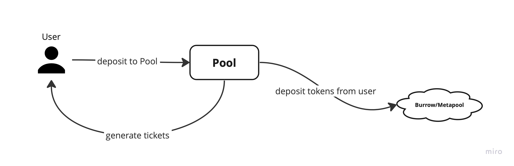
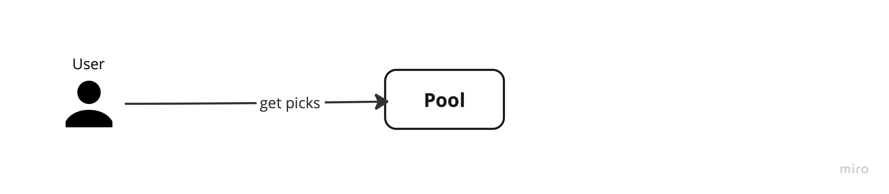
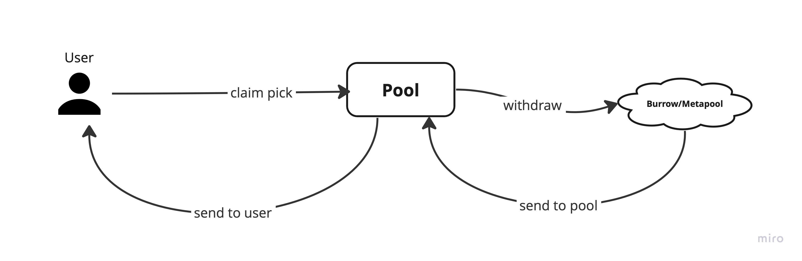
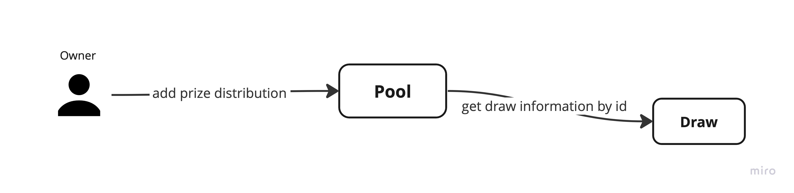
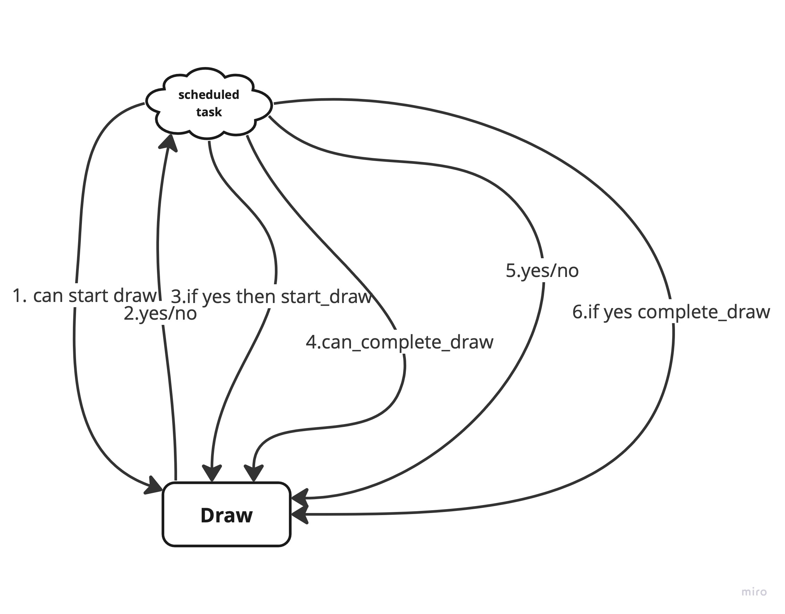

# Architecture

Pool Together architecture has 2 main parts:
- Pool contract
- Draw contract

## Pool contract
The Pool contract is the main contract of the protocol, it has the following functions:

- Handle user deposit
- Issuing tickets
- Check generated rewards
- Add prize distribution
- Generate picks for user
- Claim reward

## User interaction
A User can interact with the Pool contract to:

- Transfer FT tokens
- Receive tickets
- Generate picks
- Claim picks
- Withdraw deposit

## User Workflow

1. User deposits FT token to Pool contract.
2. Pool contract issues Pool Tickets
3. User get picks for draw
4. User claims pick for draw

## Owner/Authorized user Workflow for Pool
1. Owner gets reward for Pool
2. Owner adds prize distribution

## Authorized user Workflow for Draw
The user should be used as part of a scheduled task, every X epochs.
1. Checks if draw can be started.
2. Checks if draw can be completed.

